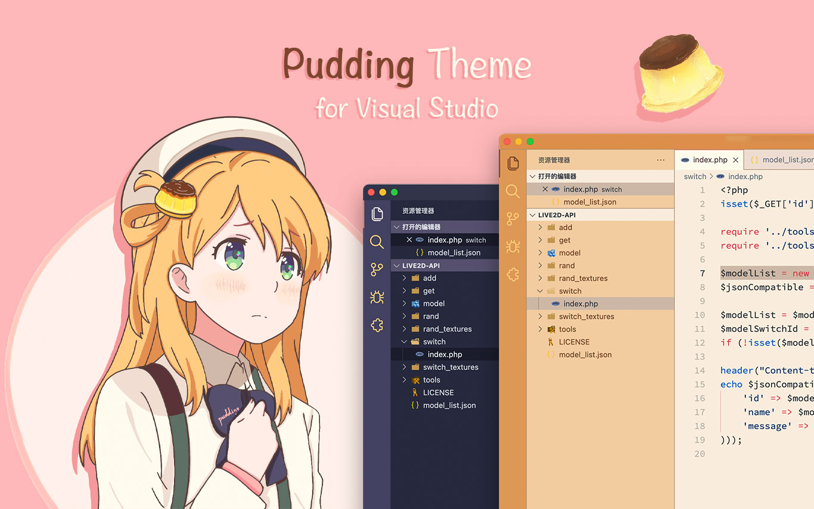
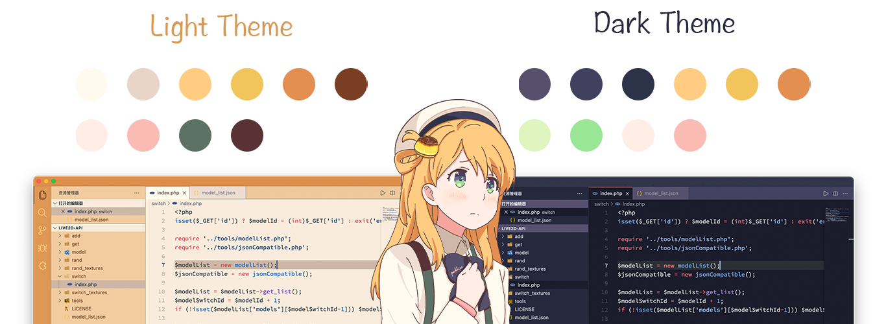

 
 <h2 align="center">Pudding Theme</h2>
 
A Pudding Color Theme for Visual Studio Code

  
  
  
  

  <a href="README.zh-CN.md">简体中文</a> | <a href="README.md">English</a>

## 1.VSCode 布丁主题

Visual Studio Code 布丁主题目前共有两款配色，一款亮色主题，一款深色主题：

## 2.配色方案

此主题的配色方案，来自于原创的二次元人物 —— **布丁（Pudding）**。提取布丁绘画形象中的颜色，然后使用这些绘画配色开发了这款布丁主题。

由于此配色最初是为了绘画，因此应用到 Visual Studio Code 等的程序主题中，可能存在一些颜色不合适的问题，后续将会不断进行更新优化，调整主题的最佳样式。

## 3.安装

1. 转到 [VS 市场](https://marketplace.visualstudio.com/items?itemName=Bitcookies.pudding-vscode-theme)。
2. 单击 “安装” 按钮。
3. 然后[选择一个主题](https://code.visualstudio.com/docs/getstarted/themes#_selecting-the-color-theme)。目前有以下主题可用：
   - `Pudding Light`
   - `Pudding Dark`

随着布丁衣装立绘的更新，未来会推出更多主题配色。

## 4. 许可

主题代码使用 [MIT license](https://github.com/bitcookies/winrar-keygen/blob/master/LICENSE)，但不包含立绘。

布丁人物立绘版权归作者所有：[Haoning Wu](https://github.com/windmill0503)。

