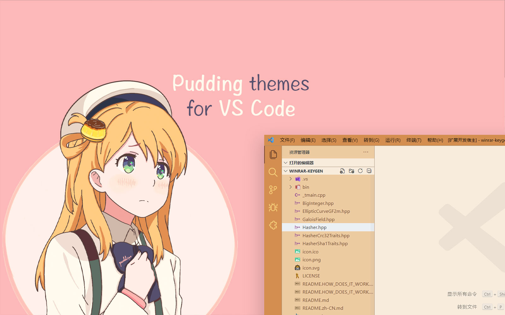

 
 <h2 align="center">布丁主题</h2>
 
一个二次元风格布丁颜色的 Visual Studio Code 主题

  
  

  <a href="README.zh-CN.md">简体中文</a> | <a href="README.md">English</a>

## 1. 即将到来

正在开发中，分支 `dev`。

## 2. 许可

使用 [MIT license](https://github.com/bitcookies/winrar-keygen/blob/master/LICENSE)